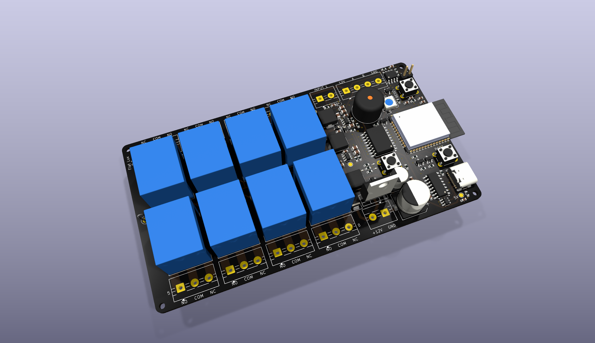
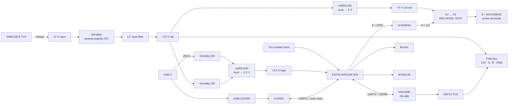

# ESP32 Relay Controller

**An 8-channel relay controller with Wi-Fi, an RS-485 field bus, and a 12 V power rail for downstream nodes.**
Designed as the master board for a small home-automation network: this board switches loads directly, talks to
the outside world over Wi-Fi, and powers and polls a chain of low-cost slave boards (ATtiny / STM32 class) over RS-485.



Open hardware. KiCad 10 source, fabrication outputs, BOMs with LCSC part numbers, and a pick-and-place file are all in this repository. Rev 1 has been manufactured.

---

## Features

- **ESP32-WROOM-32D** (16 MB flash) — Wi-Fi + Bluetooth, USB-C programming via CH340C with auto-reset
- **8 × SPDT relays** (SRD-05VDC, 10 A contacts), driven by a ULN2803A with built-in flyback clamps, each brought out to a 3-way screw terminal (NO / COM / NC)
- **RS-485 half-duplex master** — MAX3485 (3.3 V), SM712 surge protection, jumper-selectable 120 Ω termination, fail-safe biasing
- **12 V field bus power** on the RS-485 connector, so slave nodes need no local supply
- **12 V input** with P-FET reverse-polarity protection, bidirectional TVS, and an LC input filter
- Two synchronous bucks (LMR51430): 5 V for relay coils, 3.3 V for logic — the 3.3 V rail also runs from USB alone for bench programming
- One dry-contact input (pull-up, RC filter, ESD clamp), active buzzer, WS2812B status LED, rail indicator LEDs
- RESET / BOOT / user (WPS) buttons, 2 mm mounting holes, 124.75 × 68 mm, 2-layer

---

## Block diagram



---

## Specifications

| | |
|---|---|
| Supply | 12 V DC nominal (LMR51430 bucks accept 4–36 V; TVS clamps at 18 V standoff) |
| Board draw @ 12 V | ~170 mA idle · ~520 mA worst case (all relays + Wi-Fi TX) |
| Field-bus power budget | ~1.8 A at 12 V on J12 — set by the 1.0 mm feed trace (2.4 A @ 10 °C rise) less the board's own draw; L3 is rated 4.5 A |
| Relay contacts | SPDT, 10 A / 250 VAC rated · **PCB traces sized for ≤ 2.3 A at 12–30 V** (see [design notes](docs/design-notes.md#relay-bank-and-switched-load-clearances)) |
| Relay coil drive | ~4.0 V at the coil vs 3.75 V pick-up spec — all eight channels |
| RS-485 | Half-duplex, 3.3 V transceiver, 120 Ω termination via JP1, 330 Ω fail-safe bias (this node only) |
| USB | USB 2.0 Full Speed (CH340C), USB-C receptacle, 5.1 k CC pull-downs, VBUS ESD array |
| Logic level | 3.3 V throughout; WS2812B fed through a series diode so 3.3 V data meets its V<sub>IH</sub> |
| Dimensions | 124.75 × 68 mm, 1.6 mm FR-4, 2 layers, 1 oz copper |
| Mounting | 4 × Ø2.0 mm holes at the corners |

---

## Repository layout

```
esp32-relay-controller/
├── README.md
├── hardware/
│   ├── kicad/                     KiCad 10 project (schematic, PCB, custom rules, project symbol lib)
│   ├── fabrication/
│   │   ├── gerbers/               RS-274X gerbers + Excellon drill files (fab layers only)
│   │   ├── esp32-relay-controller-gerbers.zip
│   │   ├── BOM.csv                Master BOM — every fitted part, SMD and through-hole, with LCSC + MPN
│   │   ├── BOM-JLCPCB.csv         SMD-only, JLCPCB column format
│   │   ├── BOM-PCBWay.csv         SMD-only, MPN-first for PCBWay
│   │   ├── CPL.csv                SMD pick-and-place (Designator / Mid X / Mid Y / Layer / Rotation)
│   │   └── README.md              How to order
│   └── images/                    Renders and layer plots
├── docs/
│   ├── schematic.pdf
│   ├── design-notes.md            Design decisions, the review process, and what changed as a result
│   └── pinout.md                  ESP32 GPIO map, relay ↔ terminal ↔ GPIO table, connector pinouts
└── firmware/                      (placeholder — pin definitions to get started)
```

---

## Getting boards made

Everything a fab needs is in [`hardware/fabrication/`](hardware/fabrication/). The short version:

1. Upload `esp32-relay-controller-gerbers.zip` for the bare PCB — 2 layer, 1.6 mm, 1 oz, any colour.
2. For SMD assembly, upload `BOM-JLCPCB.csv` + `CPL.csv` (JLCPCB) or `BOM-PCBWay.csv` + `CPL.csv` (PCBWay). 72 SMD parts, 35 lines.
3. Hand-fit the 25 through-hole parts: 8 relays, 11 screw-terminal blocks, the TO-220 FET, buzzer, three tact switches and the termination header. All are common parts; LCSC numbers are in `BOM.csv`.

See [`hardware/fabrication/README.md`](hardware/fabrication/README.md) for gerber-origin caveats, the one DFM query a fab may raise, and which parts are safe to substitute.

---

## Firmware quick reference

Full map in [`docs/pinout.md`](docs/pinout.md).

| Function | GPIO | Notes |
|---|---|---|
| Relay 1 … 8 (silkscreen order) | 14, 19, 25, 13, 23, 33, 32, 18 | Active-high into ULN2803A |
| RS-485 TX / RX / DE+RE | 17 / 16 / 2 | GPIO2 has a 10 k pull-down → receive mode at boot |
| Dry-contact input | 34 | Input-only pin, external 10 k pull-up, closes to GND |
| User button (WPS) | 35 | Input-only, 10 k pull-down, pressed = high |
| Buzzer | 26 | Via NPN, active-high |
| WS2812B data | 27 | Through 330 Ω |
| UART0 (USB) | 1 / 3 | CH340C with DTR/RTS auto-reset |
| I²C | 21 / 22 | Routed to pads but **no pull-ups fitted** in rev 1 |

---

## Design notes

The interesting engineering is in [`docs/design-notes.md`](docs/design-notes.md). Highlights:

- **Why the field bus carries 12 V and not 3.3 V** — cable drop and the thermal ceiling of a SOT-23-6 buck make 3.3 V distribution a dead end past a couple of nodes; regulating at each slave costs one LDO and removes the constraint.
- **Reverse-polarity protection with a P-FET, and why the TVS sits in front of it** — a unidirectional clamp ahead of the FET would short a reversed supply, so it's a bidirectional part.
- **Relay coil drive margin** — the SRD-05VDC needs 3.75 V to pull in; behind a ULN2803A the coil sees ~4.0 V. A series diode in the original design put one channel *under* the limit and was removed.
- **Driving a 5 V WS2812B from a 3.3 V GPIO** — a diode in the LED's supply drops V<sub>DD</sub> into the window where 3.3 V is a valid high, without a level shifter.
- **A KiCad DRC gotcha** — custom rules that match on auto-generated net names like `Net-(J2-Pin_1)` silently never fire. The rules in this project match on a netclass instead.
- **What the design review caught** — the board went through a full netlist, DRC, ERC and geometric-connectivity audit before ordering; the findings and fixes are documented.

---

## Status

| Revision | Date | Notes |
|---|---|---|
| **Rev 1** | Sep 2026 | Ordered. 0 DRC errors, 0 unconnected nets, all nets verified single-island. |

Known rev 1 limitations and the planned rev 2 changes are listed at the end of the [design notes](docs/design-notes.md#rev-2-backlog).

---

## Licence

Copyright © 2026 Pareekshit Sachan.

This source describes Open Hardware and is licensed under the **CERN-OHL-P v2** (`SPDX-License-Identifier: CERN-OHL-P-2.0`). You may redistribute and modify this documentation and make products using it under the terms of the CERN-OHL-P v2 — see [`LICENSE`](LICENSE) or <https://cern.ch/cern-ohl>.

This documentation is distributed WITHOUT ANY EXPRESS OR IMPLIED WARRANTY, INCLUDING OF MERCHANTABILITY, SATISFACTORY QUALITY AND FITNESS FOR A PARTICULAR PURPOSE. Please see the CERN-OHL-P v2 for applicable conditions.

Symbols, footprints and 3D models from the KiCad libraries are used under the [KiCad library licence](https://www.kicad.org/libraries/license/) (CC-BY-SA 4.0 with exception). Datasheets referenced in the design notes remain the property of their manufacturers.
